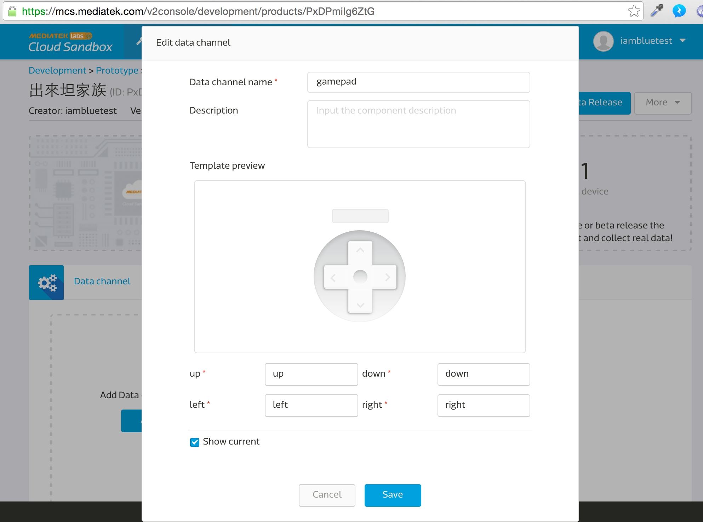

## Make a remote tank with LinkIt smart 7688 Duo and MCS gamepad channel


### Prerequisite

Please read [this tutorial](https://mcs.mediatek.com/resources/latest/tutorial/getting_started) to creating a test device in MCS. It will contain only one gamepad (control type) and one data channel with data channel ID named ‘gamepad.'

Please refer to the following image for details on creating data channel:



Note: After the test device is created in MCS, the deivceId and deviceKey can be found at the top right corner of device detail page. The deivceId and deviceKey are required in the following steps.

### Preparation

* L289N motor-driven version
* A tank kit like this : http://goods.ruten.com.tw/item/show?21438261771967

### Architecture


The four pins of L298N are connected to D2, D3, D4, D5 of Linkit smart 7688 Duo.

### Steps on MCU (ATMega32U4) side

* Open Arduino IDE.
* In Tools -> board, choose Linkit smart 7688.
* Port -> select the one with Linkit smart 7688 port. 
* Burn code from this site:  https://gist.github.com/iamblue/c71727f6cba953fcfd70


### Steps on MPU (MT7688) side

* Conform the connection with linkit smart 7688.
* ssh into it.
* Create a folder, go into it, and init npm:
    ``` 
        mkdir app && cd app && npm init
    ```
* Install MCSjs modules:
    ``` 
        npm install mcsjs
    ```
* Edit app.js:
    ```
        vim app.js
    ```
* Input the following content: (Check this for details: https://gist.github.com/iamblue/27d79a58827093f4442c)
    ``` js
        var mcs = require('mcsjs');

        // regist your device to mcs.
        var myApp = mcs.register({
            deviceId: 'Input your deviceId',   // Input your deviceId.
            deviceKey: 'Input your deviceKey', // Input your deviceKey.
        });

        var SerialPort = require("serialport").SerialPort;
        var serialPort = new SerialPort("/dev/ttyS0", {
            baudrate: 57600
        });

        // communicate with Arduino chip (32U4).
        serialPort.on("open", function () {
            // listen the mcs command.
            myApp.on('gamepad', function(data, time) { // gamepad is your datachannel.
                serialPort.write(data); // send message to Arduino chip.
            });
        });
```

* Save and run node app (Don’t close command line window)
* Switch back to MCS screen, press up, down, left, or right arrows on this channel. You can use w, s, a, d key on keyboard instead.


* The tank will move now!
