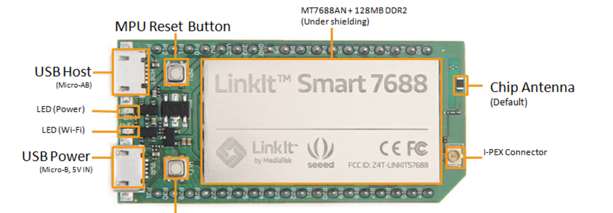

## Initial Setup

### Preparation
* One microUSB cable. Please attach the USB connector to the PC or electric outlet, and the microUSB connector to the microUSB connector on the beveled side of LinkIt smart 7688 board (i.e. the USB Power shown in the following figure).

### Steps

* Open your PC and scan WiFi AP.
* Choose `Linkit_Smart_7688_XXXXXX`,after your PC connected to the LinkIt smart 7688 board, make sure to see the orange light starting to flash on the LinkIt smart 7688 board.
* Open your browser, type http://mylinkit.local/ in your URL command line.
* Now you will see the screen like this:
    
* The initial password needs to be set in the first time usage for 7688. Please enter the initial password you want to setup in this screen.
* After finishing the password setup, it will transfer to the login page automatically.
    
* Enter the password you just typed, if it is correct, it will transfer to the page like this:
    
* Link successfully!

It is strongly suggested to read the following chapters for players.

### How to ssh into LinkIt smart 7688?

[Click to read](/)

### How to burn Arduino code into LinkIt smart 7688 Duo?

[Click to read](/)

### How to setup WiFi mode (AP mode or Station mode)?

[Click to read](/)
