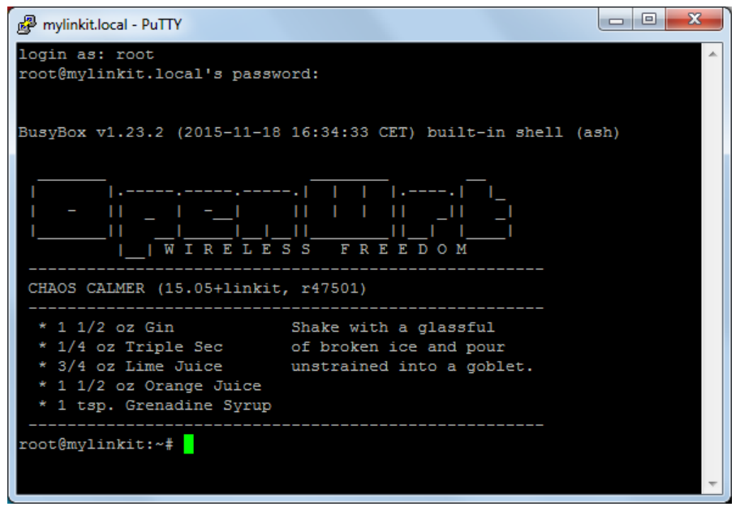

## How to ssh into LinkIt smart 7688?


### Mac & Linux

* Make sure that your PC is in the same network or listens to the same WiFi AP with LinkIt smart 7688.
* Open your command line and type: 
* 
```
    ssh root@mylinkit.local
```

### Windows

* Open your PuttY, an setup as follows:


* If you see this picture, please choose “Yes”.


* After that, you can enter to the terminal:



Note: 

1. (Not necessary to read) If you need to change your device name on the WebUI some time in the future (for example, to change to apple.local), please type the following instruction in your command line:

```
    ssh root@apple.local
```
