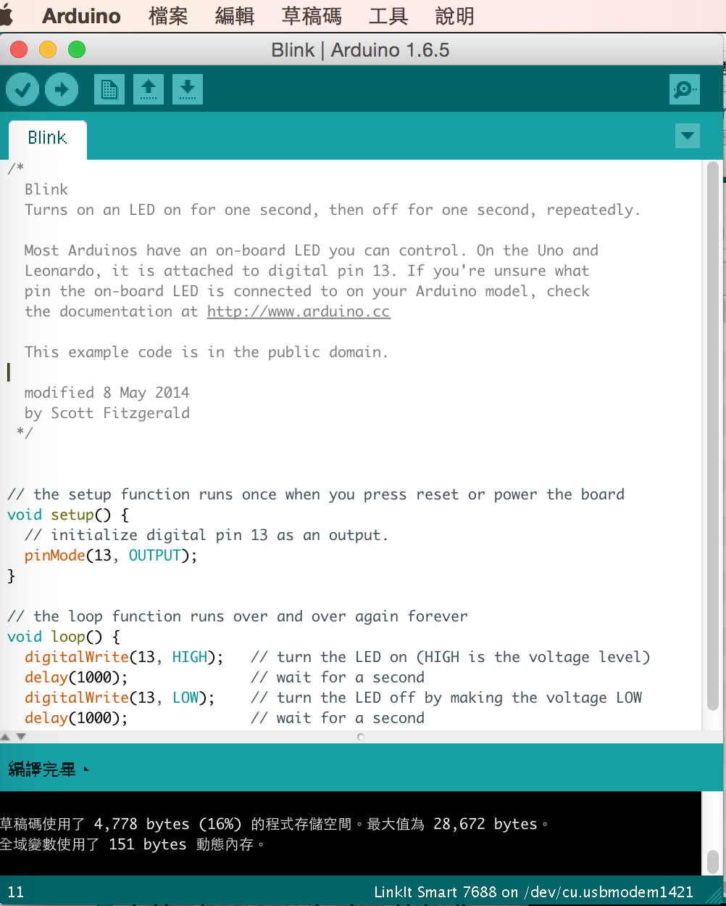
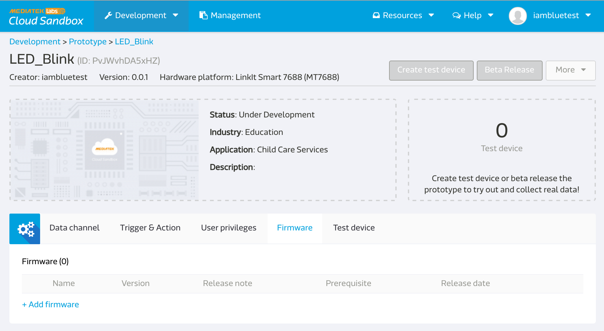
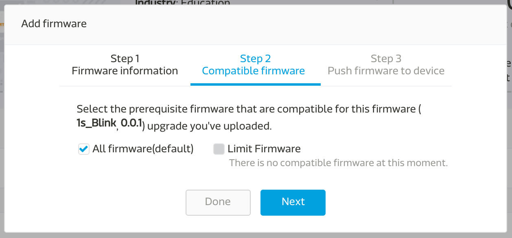
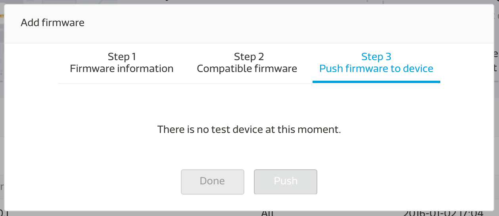
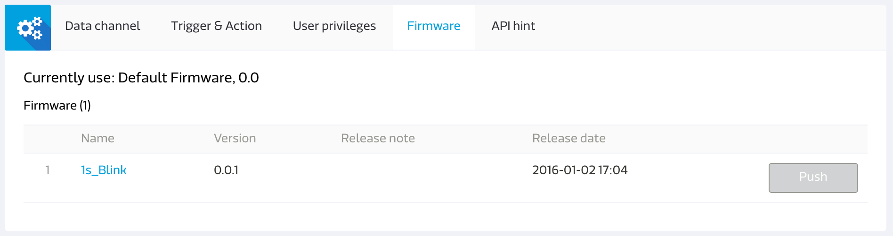

## FOTA

FOTA 全名是 Firmware Over The Air.
以下為簡單 Demo，透過 MCS 介面空中更新 firmware 給LinkIt smart 7688 Duo 的 Arduino，第一次按下 Push 鈕為『更新每 1s 閃爍一次』第二次按下 Push 鈕為『更新每 100ms 閃爍一次』：

https://www.youtube.com/watch?v=njv5SzlUkMI 

### 如何從 Arduino IDE build 出 hex 檔 for Arduino chip?

* 準備好您寫好的 Arduino code:

* 點選草稿碼:

* 點選 `Export compiled Binary`，之後就會產生出這一個 `.hex`:

這個 `.hex` 的檔案就是等等要上傳到 MCS 的 firmware.

### 在 LinkIt smart 7688 所需要的準備。
* ssh 進去 LinkIt smart 7688 
* create new folder 
* npm init
* npm install mcsjs
* copy this code:
* 若您希望每次開機時啟動這段 code 

### 如何利用 MCSjs 利用 FOTA 更新 Arduino?

* 首先，先進去你的 Protoype:

* 點選firmare

* 點選 Add firmware，打入以下資料( File upload 就是上傳從Arduino IDE 所輸出的 .hex 檔):

* 進到第二步驟後，按下`Next`:

* 完成後，點選 Done:

* 若您尚未創建 Test device，請記得在頁面上點選` Create test device`
* 進去您產生好的 Test device 頁面
* 點選 firmware :

* 若您的 Device 已在線上，這個 Push 按鈕就會變成藍色，點擊後就可以進行 FOTA 推送新的 firmware 給 7688 囉。
