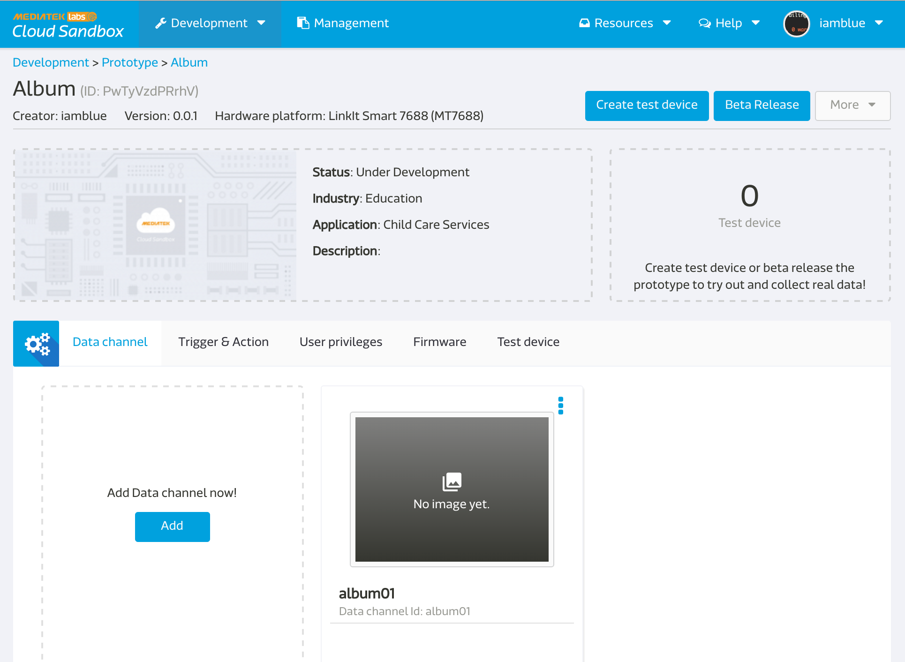
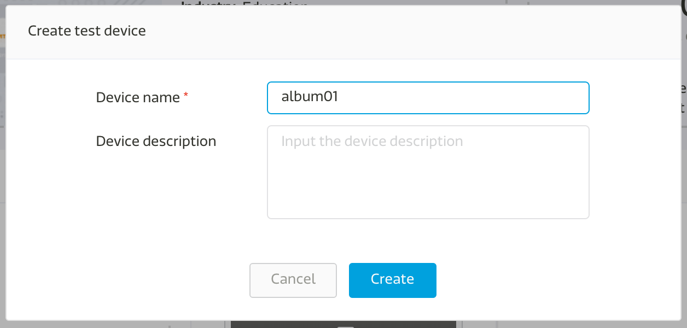
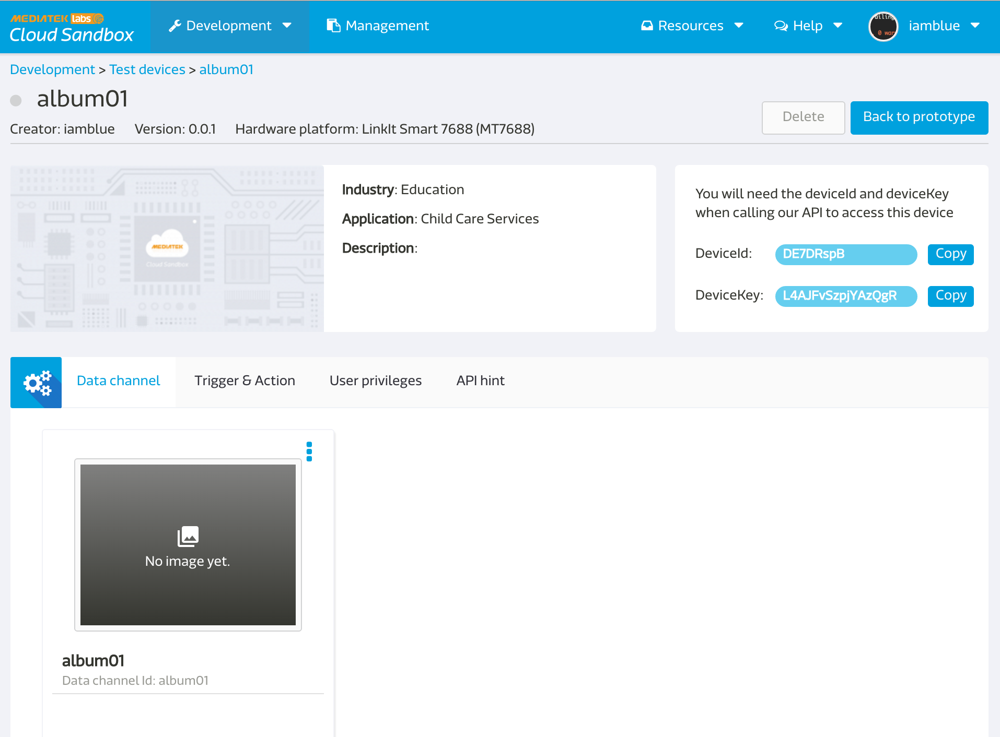

# 拍照上傳至 MCS (草稿，未完成)

(本章節功能還尚未 release)

本篇 LinkIt smart 7688 , LinkIt smart 7688 Duo 皆可以適用.

本章節教各位怎麼上傳圖片至 MCS.

## 準備事項

* 先準備好一條 usb OTG 線
* 準備好您的 web camera ( 本篇範例是使用羅技 C310)
* 將電源線插入PWR, web camera 插入 usb OTG 在插入 7688 上的 HOST 。

## 在 MCS 上要做的事情

* 進去 prototype 詳情頁面，點擊 `Add Data Channel now`:

* 創建一個 display 形式的 datahchannel:

* Data type 選擇 image，其他空格按照您的需求輸入，注意這時候打的 data channel id 就是等一下會用到的 `dataChnId` :

* 回到 prototype 詳情頁面，點選 `create test device`:


* 進去 device 頁面後，就可以看到 `deviceId`, `deviceKey`:



## 在 Device 端要做的事情

* ssh 進去您的 7688:
* 安裝 `fswebcam`:

```
opkg update
opkg install fswebcam
```
* 測試是否能拍一張照片:

```
fswebcam -i 0 -d v4l2:/dev/video0 --no-banner -p YUYV --jpeg 95 --save /tmp/test.jpg
```
之後你就會看到你的根目錄下面有一個 test.jpg 的檔案。

###注意
也許會問為什麼要存到 /tmp/test.jpg ? 

因為LinkIt smart 7688 的 flash 有讀寫的壽命，若太頻繁的在 flash 上做寫入動作容易降低 flash 壽命，因此建議存放在 memory 之中， /tmp folder 下即是使用 memory 空間，但記得每次一斷電存放在 flash 的空間就會自動被reset 回原值。

* 編輯 app.js

```
vim app.js
```

* 將這段 code copy 進去:

``` js
var mcs = require('mcsjs');
var exec = require('child_process').exec;
var Promise = require('bluebird');
var fs = Promise.promisifyAll(require("fs"));

var myApp = mcs.register({
  host: 'api.mediatek.io',
  deviceId: 'Input your deviceId',
  deviceKey: 'Input your deviceKey',
});

child = exec('fswebcam -i 0 -d v4l2:/dev/video0 --no-banner -p YUYV --jpeg 95 --save /tmp/test.jpg', function (error, stdout, stderr) {
    console.log('stdout: ' + stdout);
    console.log('stderr: ' + stderr);
    if (error !== null) {
        console.log('exec error: ' + error);
    }
    fs.readFileAsync('/tmp/test.jpg')
    .then(function(data) {
        myApp.emit('album01','', new Buffer(data).toString('base64'));
    });
});

        child = exec('fswebcam -i 0 -d v4l2:/dev/video0 --no-banner -p YUYV --jpeg 95 --save /tmp/test.jpg',
      function (error, stdout, stderr) {
        console.log('stdout: ' + stdout);
        console.log('stderr: ' + stderr);
        if (error !== null) {
          console.log('exec error: ' + error);
        }
        fs.readFileAsync('/tmp/test.jpg')
        .then(function(data) {
           myApp.emit('album01','', new Buffer(data).toString('base64'));
        });
     });

```

* 返回你的 MCS 的 test device 那頁就可以看到成果囉!