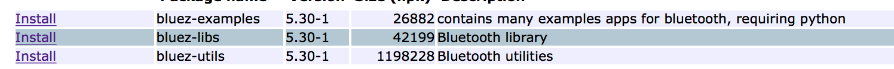
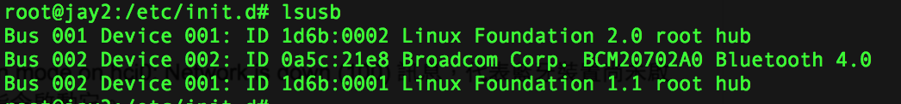
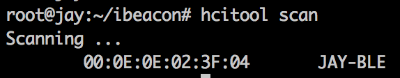
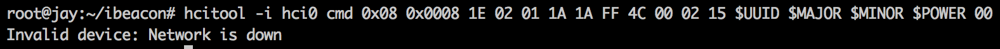

## 使用 BlueZ 在7688上 Scan BLE 功能與基本常識 (v0.1)

早期在2013年，我們便開始使用 radius network 作的 pibeacon 去作一些有趣的應用，例如：對室內的使用者作移動情境的數據分析。這一次 7688 的出現，著實是看到一個又簡單有有趣適合給軟體工程師也能做軟體與硬體整合的機會，透過了類似在 linux 的環境指令，就能達到很多事。這比起，許多模組要自己動手去重新設計，重新去作出硬體模組。這在時間上會增加許多，也節省了製作原型 (prototype) 的時間與進入門檻。
這次，便目標將原本 Respberry P1 上能做的事，也能在 7688 上被完成。以便我們能專注在分析室內位置的資料分析應用，不用再去煩惱硬體很難設計，硬體很難做等惱人的問題。第 1 步，當然是先把 bluez 搞定，讓我們的藍芽模組可以正常工作。其他的就... 再說啦。

### 環境準備
- 插上你的7688，並設定好網路
- 檢查 opkg 的更新

``` 
opkg update
```

- 安裝 bluez 所需的 packages，在此我裝了下述的東西

``` 
opkg install kmod-bluetooth bluez-libs bluez-utils kmod-usb-core kmod-usb-uhci kmod-usb2 usbutils
```

 Figure 1.

 Figure 2.


- 再檢查，需要裝什麼其他套件，我們換個作法來裝裝看，利用 openwrt 的 admin界面來找 package。
你可以在登入 7688 時，發現在右上角有一個進入 openwrt 的管理界面處，進入之後會看到左上角會有：
System > Software 點了該標簽後，即可顯示你所安裝的所有套件，並且還可以用來安裝套件喔。


	- 我們檢查了幾個套件 bluez 相關的都安裝了嗎？



	- dbus 也安裝了嗎? (呼應另一個教學文) 


在安裝了這些套件之後，終於開始要 ssh 到7688上去試試看了。

### 檢查環境
我們首先進入到 /etc/init.d 的目錄中，這個目錄的作用和 linux 是相仿的，就各位自己去學了。
接下來，我們希望 boot 後就可以自動幫我們啟動 bluetooth 相關需要的 deamon，所以我們需要做下述的 2 道指令： 

- Enable 2個服務, 設定自動啟動

```
/etc/init.d/dbus enable
/etc/init.d/bluez-utils enable
```

- 直接現在就啟動它們

```
/etc/init.d/dbus start
/etc/init.d/bluez-utils start
```

### 測試環境
在 7688 上我們有一個 USB，如果你是大頭轉成小的頭，記得要用 OTG 的。我用普通的沒有成功，但是如果你有買7688的擴充版，那個上頭大的 USB 是可以直接插入 USB devides 就可以使用的。我們檢查可以下這個指令：
```
lsusb 
```

可以查看，是否有任何 USB device 被偵測到。在此，我們的例子成功的看到了下述畫面： 


我們可以看到，第 2 行顯示他抓到了一個我安裝上去的 devices，一看名字就知道是個 bluetooth 的東西。（為什麼？不要問，很可怕的）

另外，你也可以透過 hciconfig 看看是否得到 hci0 的結果。


 
### Bluetooth 測試 1
接下來，我們來試試，環境都好了，先來假裝自己是個 BLE 裝置，然後我們開一個 App 看看是否可以找到它。在這裡我們使用 iOS 上的 lightBlue 來作測試。在模擬成為一個 BLE 裝置時有一些必須設定的參數，例如：UUID, Major, Minor, Power強度等等。在此你可以寫成設定如下，像其他 blog 說明的，他作了下述的設定：

ble.conf
```
export BLE_DEVICE=hci0
export UUID="e2 c5 6d b5 df fb 48 d2 b0 60 d0 f5 a7 10 96 e0"
export MAJOR="00 01"
export MINOR="00 00"
export POWER="c8"
```

大略說明一下，BLE_DEVICE 是我在此找到的 USB 裝置介面為 hci0 ，之後便是 UUID, MAJOR, MINOR 的設定，詳情自己去 Google 這裡不作介紹。最後 POWER 是訊號發射強度，這是一個 負值 。怎麼作數值轉換，C8 (HEX) = ? (DEC) 我們也不作介紹，自己去查。

完成設定之後，我們執行下述指令，將會設定你的裝置： （如果你要用 sudo 則要去 opkg 裝好它)
```
sudo hciconfig $BLE_DEVICE up
sudo hciconfig $BLE_DEVICE noleadv
sudo hciconfig $BLE_DEVICE noscan
sudo hciconfig $BLE_DEVICE leadv
sudo hcitool -i hci0 cmd 0x08 0x0008 1E 02 01 1A 1A FF 4C 00 02 15 $UUID $MAJOR $MINOR $POWER 00
```

這一串設定數值，有點長，然後有點不想去一個一個說明，你可以再去查原始的其他 blog。基本上，最重要的 hitool up 指令千萬別忘了


接著在 App 中重新 scan 附近的 bluetooth 裝置。看到我們找到了一個叫 BlueZ 5.30 的裝置， 就是成功的找到了。


點進去，還真的可以看到東西耶，雖然設定不多。但這幾天的辛苦，就值得了。


### Bluetooth 測試 2
在這個測試中，我們會先任意打開另一個 BLE 裝置，作為所以我取了一個叫 JAY－BLE 的裝置，作為測試的目標。
我們會希望去測，是否這個藍芽裝置是否在我們的空間之中，所以我們要 scan 一下周圍。在這裡我們可以利用指令： 
``` 
hitool scan
```

這樣子我們便可以等待一下子，得到我先前在周圍先開啟的 BLE 裝置。


### 撰寫啟動和關閉的腳本 (Script)
因為每次要啟動設定很累，所以我們參照了別的布落格，同樣的作了3個設定檔，以便我們每次執行方便。
我們這裡寫了 ble.conf，start.sh 和 stop.sh。都是和 linux 相同的內容，所以細節就要自己去查詢了。

- ble.conf
```
#!/bin/sh
. ./ble.conf
echo
echo "Enable iBeacon singal Advertising ..."
sudo hciconfig $BLE_DEVICE up
sudo hciconfig $BLE_DEVICE noleadv
sudo hciconfig $BLE_DEVICE noscan
sudo hciconfig $BLE_DEVICE leadv
sudo hcitool -i hci0 cmd 0x08 0x0008 1E 02 01 1A 1A FF 4C 00 02 15 $UUID $MAJOR $MINOR $POWER 00
echo "Complete"
```

細節說明可以去參照 [2]。

- start.sh
```
#!/bin/sh
. ./ble.conf
echo
echo "Enable iBeacon singal Advertising ..."
sudo hciconfig $BLE_DEVICE up
sudo hciconfig $BLE_DEVICE noleadv
sudo hciconfig $BLE_DEVICE noscan
sudo hciconfig $BLE_DEVICE leadv
sudo hcitool -i hci0 cmd 0x08 0x0008 1E 02 01 1A 1A FF 4C 00 02 15 $UUID $MAJOR $MINOR $POWER 00
echo "Complete"
```

細節說明可以去參照 [2]。

- stop.sh
```
#!/bin/sh
. ./ble.conf
echo
echo "Disable iBeacon Advertising ..."
sudo hciconfig $BLE_DEVICE noleadv
echo "Complete"
```

細節說明可以去參照 [2]。

### 結論 (Conclusion) 
7688 在安裝 bluez 的過程，經過了一段時間才通過。一開始如果自己去 compile bluez 會發生很多問題。舉凡空間不足，裝了太多東西，編譯時缺少lib之類的。很多和 linux 相關的問題，所以一定要能熟悉 linux 指令和系統的安裝等。這次成功，是因為我在安裝 libs 時，有裝到正確的，而不只是由 bluez 開始安裝。算是無意間的新手運吧，如果你的裝置是比較抓不到的，建議可能還是要一個 cross-compiler 讓你自己編你的環境。
總之，7688平台還算容易編工具，這次運氣也還不差，弄了幾天也算是完成了第 1 步。

在開發過程難免會有環境重設的狀況，所以建議是將資料放到 github 或者存放在 sd card 中。

### 疑難排解
- 如果出現 Network is down ，就是表示你的 hci0 沒有啟動，再啟動一下就好了。


### 參考資料 (Reference)
[1] https://wiki.openwrt.org/doc/howto/usb.bluetooth
[2] http://cheng-min-i-taiwan.blogspot.tw/2015/03/raspberry-pi-40ibeacon.html
[3] http://developer.radiusnetworks.com/pibeacon/pibeacon-instructions.html
[4] https://github.com/RadiusNetworks?page=3
[5] https://learn.adafruit.com/downloads/pdf/pibeacon-ibeacon-with-a-raspberry-pi.pdf
[6] http://blog.cavedu.com/programming-language/appinventor/appinventorandarduinowithbluetooth3/
[7] https://learn.adafruit.com/pibeacon-ibeacon-with-a-raspberry-pi/overview

