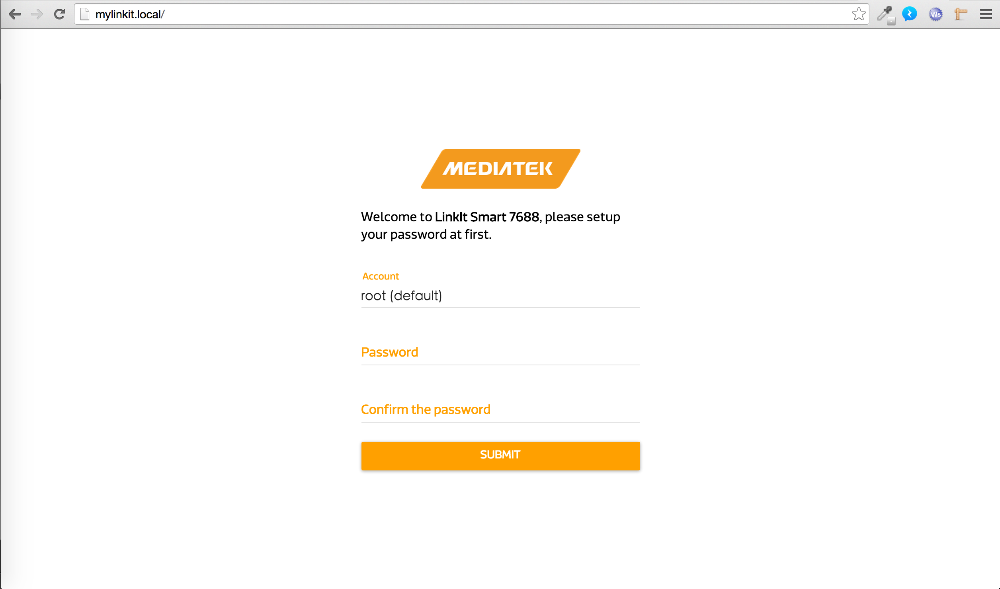
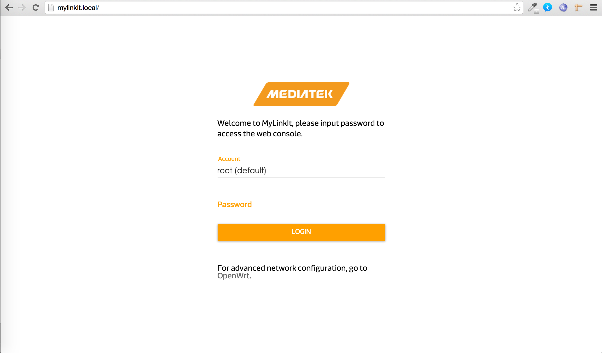
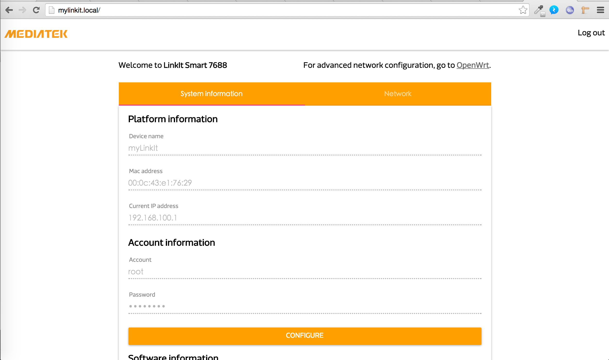

## 開箱設定

### 準備
* 一條 microUSB 傳輸線，請把 USB 那端接在電腦或插座上， microUSB 那頭插在 LinkIt smart 7688 有斜角那側的 USB 孔上 ( 即圖中的 USB Power ):

### 步驟

* 打開你的電腦掃描 wifi ap
* 點選 `Linkit_Smart_7688_XXXXXX`，確定電腦連上這個 LinkIt smart 7688 後，會看到 LinkIt smart 7688 版子上的會開始閃爍橘色的燈。
* 打開你的 browser ，在 url 中輸入: http://mylinkit.local/
* 這時就會看到像這樣的畫面:
    
* 7688 第一次使用需要設定初始密碼，請在這畫面輸入您想設定的初始密碼。
* 設定完成會自動到登入頁面:
    
* 輸入您剛剛所設定密碼，若成功會跳轉回像這樣的畫面:
    
* 開箱成功!

接下來幾個章節建議建議各位玩家一定閱讀：

### 如何 ssh 進 linkit smart 7688?

[點我閱讀](/)

### 如何燒錄Arduino code 進去 linkit smart 7688 Duo?

[點我閱讀](/)

### 如何設定 wifi 模式( AP mode or Station mode )?

[點我閱讀](/)
