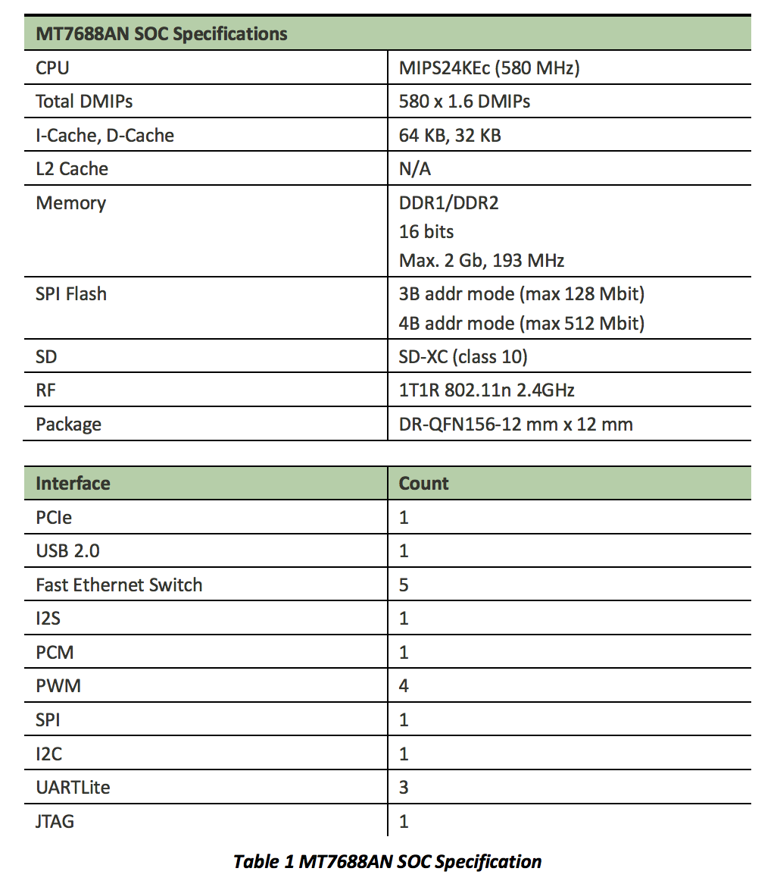

## 前言

聯發科在 2015/12/1 當天發布兩塊 LinkIt smart 系列的版子，分別為 7688 及 7688 Duo。

## 架構圖：

這是簡單架構圖表示 7688 與 7688 Duo，我們可以看到兩塊版子都使用 MT7688 晶片。 7688 Duo 比 7688 多一顆 Arduino 晶片 (32U4)，簡單來說，擁有 Duo 人可以多出使用 Arduino sensor 的玩法。 

## 關於 MT7688

以下是 MT7688 這塊晶片的規格，
