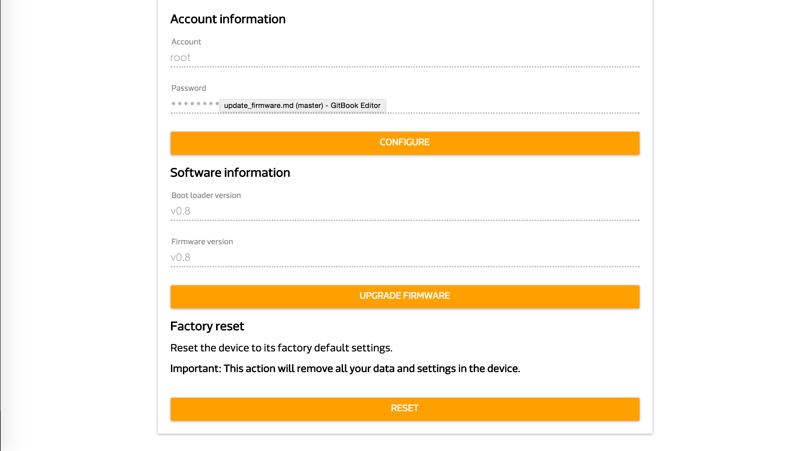
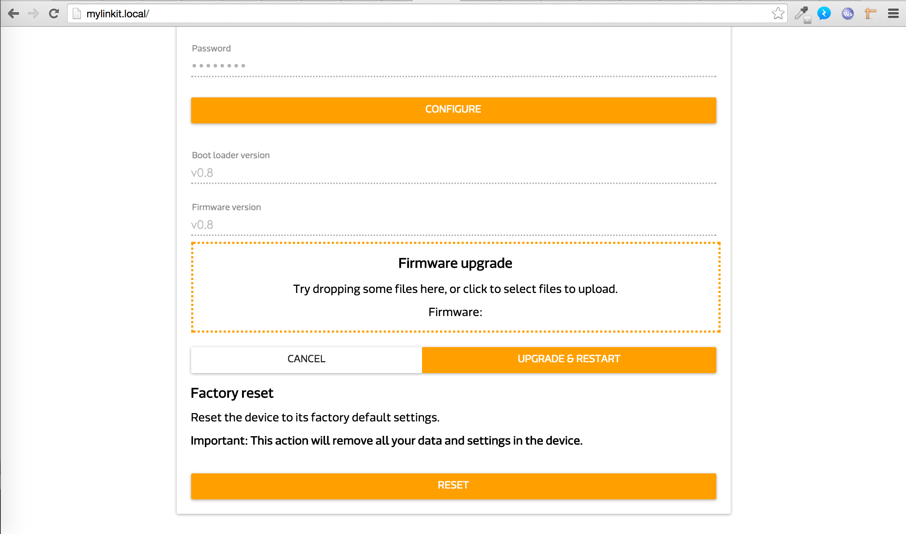

## 如何更新 firmware

* 進去您的 WebUI 後，滾到最下頁:
* 
* 點選 Upgrade firmware:
* 
* 把你要更新的firmware檔，透過點選橘色線條內的區域或者是拖拉檔案到這區域後即可上傳。
* 檔案上傳完成後，靜置約 2~3 min。
* 之後你會在電腦搜尋到 Linkit_Smart_7688 這個 wifi 即表示 firmware 更新成功。