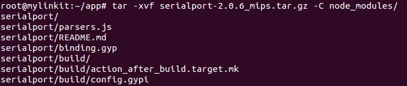

## Cross-build node.js modules/addons 

### Aim

This section introduces you how to cross-build node.js native modules/addons.

Note: When you encounter difficulty in installing a node module which require rebuild, this section can give you a hand.

## Prerequisition

### Step up the environment on a host PC
* OS: Ubuntu 14.04 LTS x86_64
* Node version: 0.12.7 (you can use **n** or **nvm** to switch node version, I am using **n**)

    ``` bash
    $ sudo n 0.12.7
    ```

* Npm version: 2.11.3

    ``` bash
    $ sudo npm install -g npm@2.11.3
    ```

* Install the following packages on your Ubuntu

    ``` bash
    $ sudo apt-get install subversion build-essential gcc-multilib g++-multilib
    ```

* Clone [mt7688-cross](https://github.com/simenkid/mt7688-cross) project down to your Ubuntu. If you don't have git, just download this project as a zip file from github.  


    ``` bash
    $ git clone https://github.com/simenkid/mt7688-cross.git
    ```

* Switch into the working directory `mt7688-cross/`, and invoke the script `./create_env.sh` to create the cross-compiling environment. This step may take you around 20 minutes, have a cup of coffee and be patient.  

    ``` bash
    $ cd mt7688-cross
    ~/mt7688-cross $ 
    ~/mt7688-cross $ ./create_env.sh
    ```

    * Note: Once this step is successfully done, the environment is ready for your later use. Every time you want to cross-compile a node native module, just come into the working directory `mt7688-cross/` and install a module with script `npm_install.sh`, there is no need to rebuild the environment again.  

### Steps of installing a node native module/add-on to Linkit Smart 7688  

* In the working directory, use script `npm_install.sh` to install a cross-build node module.  

    ``` bash
    ~/mt7688-cross $ ./npm_install.sh foo-module
    ```

    * or install a specified version  

    ``` bash
    ~/mt7688-cross $ ./npm_install.sh foo-module@version
    ```

    * Let's take installation of `serialport` module as an example:  

    ``` bash
    ~/mt7688-cross $ ./npm_install.sh serialport
    ```


* The cross-built module is zipped in `mt7688-cross/node_modules_mips` folder.  

    ``` bash
    ~/mt7688-cross $ cd node_modules_mips
    ~/mt7688-cross/node_modules_mips $ ls
    ```

* Upload the compressed module to Linkit Smart 7688.  
    
    ``` bash
    ~/mt7688-cross/node_modules_mips $ scp foo-module-x.y.z.tar.gz root@192.168.0.109:/root/app
    ```


    * Note: Replace `192.168.0.109` to which your Linkit Smart 7688 allocates. Replace the remote folder `/root/app` to where you like to put this module to.  

* ssh into Linkit Smart 7688.
    
* Switch into the folder where you just uploaded to, and uncompress the zipped file into `node_modules/`.  

    ``` bash 
    > cd app
    ~/app > tar -xvf foo-module-x.y.z.tar.gz -C node_modules/
    ```


* And now, you are ready to write an `app.js` to test your module. Cheers!

        
