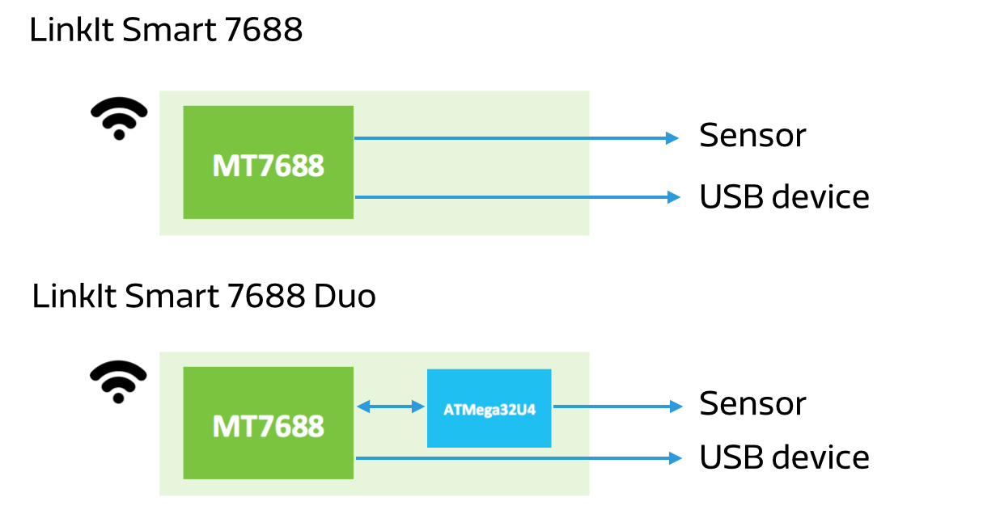

## Preface

Mediatek Inc. released two LinkIt smart series boards on 2015/12/1 - 7688 and 7688 Duo, respectively.

## Framework Diagram

This simple framework diagram shows the 7688 and 7688 Duo, as we can see, both these two boards use MT7688 chip. 7688 Duo has one more Arduino chip (32U4) than 7688. Simply speaking, users with 7688 Duo can have more options to play with Arduino sensors.

## Development Board Specification

During defining the specifications for these two 7688 development boards, the memory and flash suitable for high level language players have been surveyed. Under this specification, the problems encountered in the npm install could be nearly avoided, for example, ran out of memory, or storage space shortage (even can not install Node.js). Here is the specification:

## About MT7688

Below is the specification of MT7688, we can see that it is kind of AP router chip product, and it is belong to MPU grade chip.

