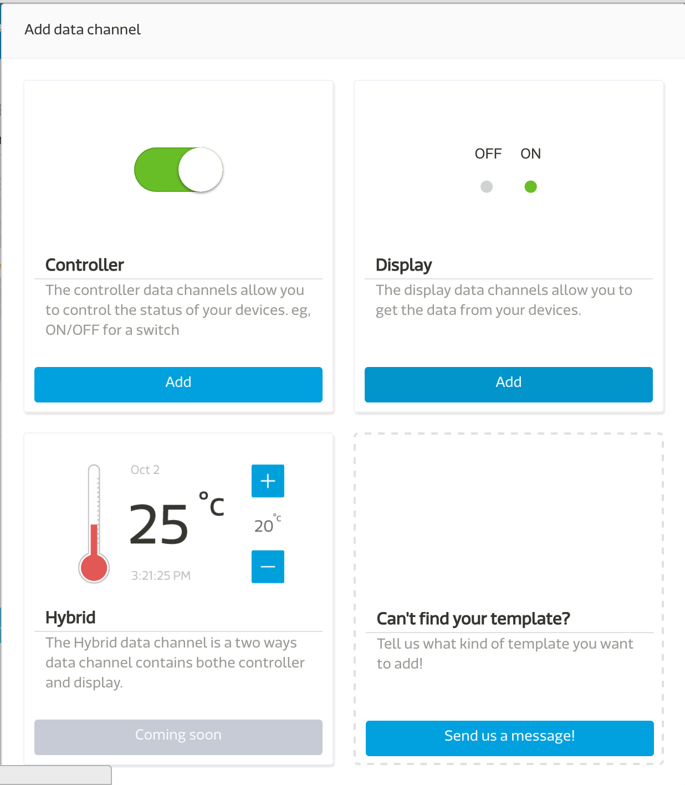
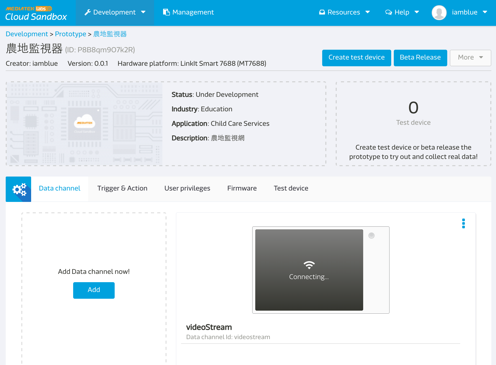
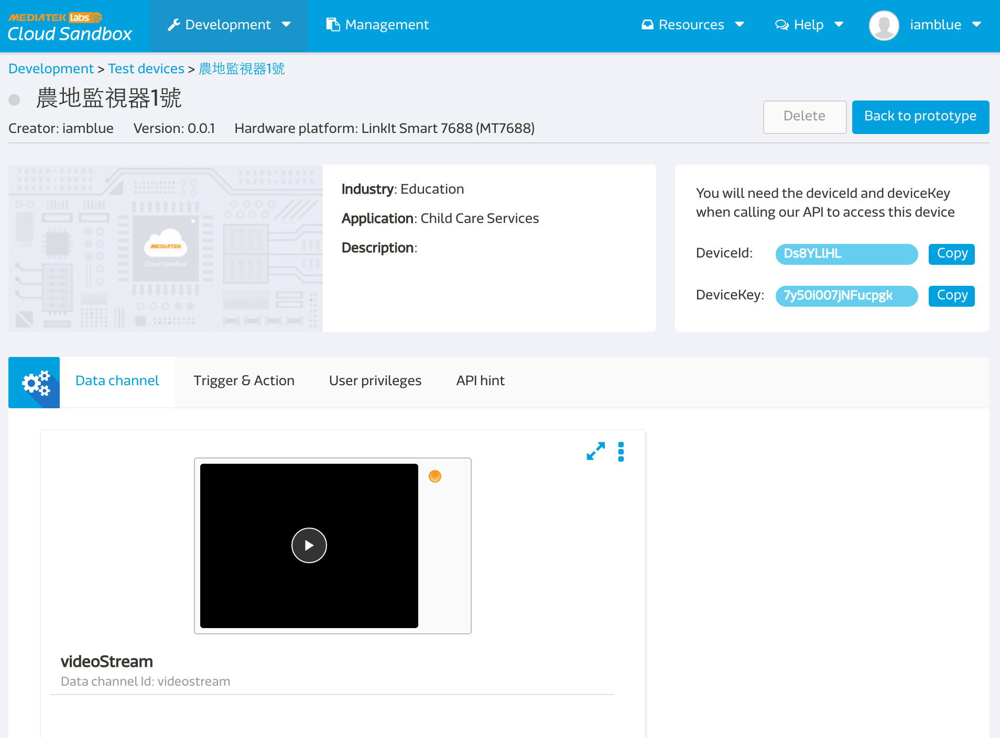
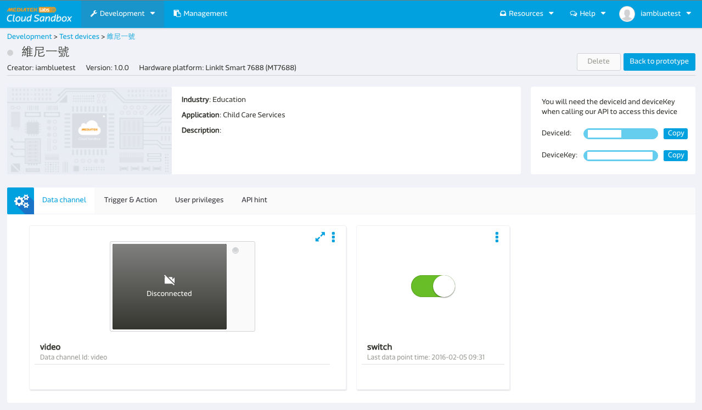

#使用 MCS 來看視訊串流


本篇 LinkIt smart 7688 , LinkIt smart 7688 Duo 皆可以適用.

## 準備事項

* 先準備好一條 usb OTG 線
* 準備好您的 web camera ( 本篇範例是使用羅技 C310)
* 將電源線插入PWR, web camera 插入 usb OTG 在插入 7688 上的 HOST 。

## 在 MCS 上要做的事情

* 進去 prototype 詳情頁面，點擊 `Add Data Channel now`:

* 創建一個 display 形式的 datahchannel:

* Data type 選擇 Video Stream，其他空格按照您的需求輸入，注意這時候打的 data channel id 就是等一下會用到的 `dataChnId` :

* 回到 prototype 詳情頁面，點選 `create test device`:

* 進去本頁面後，就可以看到 `deviceId`, `deviceKey`:



## 在 Device 端要做的事情

* ssh 進去您的 7688:
* 安裝 ffmpeg:
```
opkg update
opkg install ffmpeg
```

* 首先，先來測試 video stream 是否成功，請輸入以下指令: (`deviceId`, `deviceKey`, `dataChnId` 即為上述拿到的代號)

```
ffmpeg -s 176x144 -f video4linux2 -r 30 -i /dev/video0 -f mpeg1video -r 30 -b 800k http://stream-mcs.mediatek.com/{deviceId}/{deviceKey}/{dataChnId}/176/144
```

若在 MCS 上看到畫面代表正常~

* 新增 app folder

``` bash
mkdir app && cd app
```

* 安裝對應套件:

```bash
npm install bluebird --save
```

* 產生 `app.js` file:

``` js
var mcs = require('mcsjs');
var exec = require('child_process').exec;
var Promise = require('bluebird');
var fs = Promise.promisifyAll(require('fs'));
var deviceId = 'Input your deviceId';
var deviceKey = 'Input your deviceKey';
var dataChnId = 'Input your `video stream` data channel Id';
var width = 176;
var height = 144;

var myApp = mcs.register({
  deviceId: deviceId,
  deviceKey: deviceKey,
});

exec('ffmpeg -s ' + width + 'x' + height + ' -f video4linux2 -r 30 -i /dev/video0 -f mpeg1video -r 30 -b 800k http://stream-mcs.mediatek.com/' + deviceId + '/' +deviceKey + '/' + dataChnId + '/' + width + '/' + height, function(error, stdout, stderr) {
  console.log('stdout: ' + stdout);
  console.log('stderr: ' + stderr);
  if (error !== null) {
    console.log('exec error: ' + error);
  }
});
```
記得把上面取的的 deviceId, deviceKey 還有你設定的 video stream data chennel id 貼上程式內需要輸入的地方。

* 按 ESC 後再輸入 :wq! 存擋
* 執行 node app.js 即可看到影像串流囉!

* 完成!

### 實際範例演練

台灣有一位 maker (小棟) 做了居家監控娃娃的範例( [點此案我](https://makerpro_taiwan.gitbooks.io/diy-linklt-smart-7688duo-monitor-doll/content/) )，現在我們來用 video stream 將居家監控娃娃賦予它影片串流的功能吧!

* 首先，先在 MCS 上面 create 好一個 prototype，內容有 control type 的 switch 和 display type 的 video stream 兩個 data channel

* 創建 test device 後會出現如下畫面：



* 按照最上面的步驟做後，最後的 app.js 請改成: ( 同時也請確保 7688 在 STA mode ，且可以連到外網 )

``` js
var mcs = require('mcsjs');
var exec = require('child_process').exec;
var Promise = require('bluebird');
var fs = Promise.promisifyAll(require("fs"));

var deviceId = 'Input your deviceId';
var dataChnId = 'Input your video stream data channel Id , ex: video';
var deviceKey = 'Input your deviceKey';
var width = '176';
var height = '144';

var myApp = mcs.register({
  deviceId: deviceId,
  deviceKey: deviceKey,
});

myApp.on('switch', function(data) {
  console.log(data)
  if (data === '1') {
  console.log('open')
  exec('ffmpeg -s ' + width + 'x' + height + ' -f video4linux2 -r 30 -i /dev/video0 -f mpeg1video -r 30 -b 800k http://stream-mcs.mediatek.com/' + deviceId + '/' +deviceKey + '/' + dataChnId + '/' + width + '/' + height, function(error, stdout, stderr) {
    console.log('stdout: ' + stdout);
    console.log('stderr: ' + stderr);
    if (error !== null) {
      console.log('exec error: ' + error);
    }
  });
  } else {
  exec('killall ffmpeg');
  }
});

myApp.catch(function(err){ console.log(err) });
```
* 執行 node app.js (記得screen 不能關)
* 接下來回到 device page 後，按下 switch 按鈕即可看到 video stream 服務囉!
* 完成!
